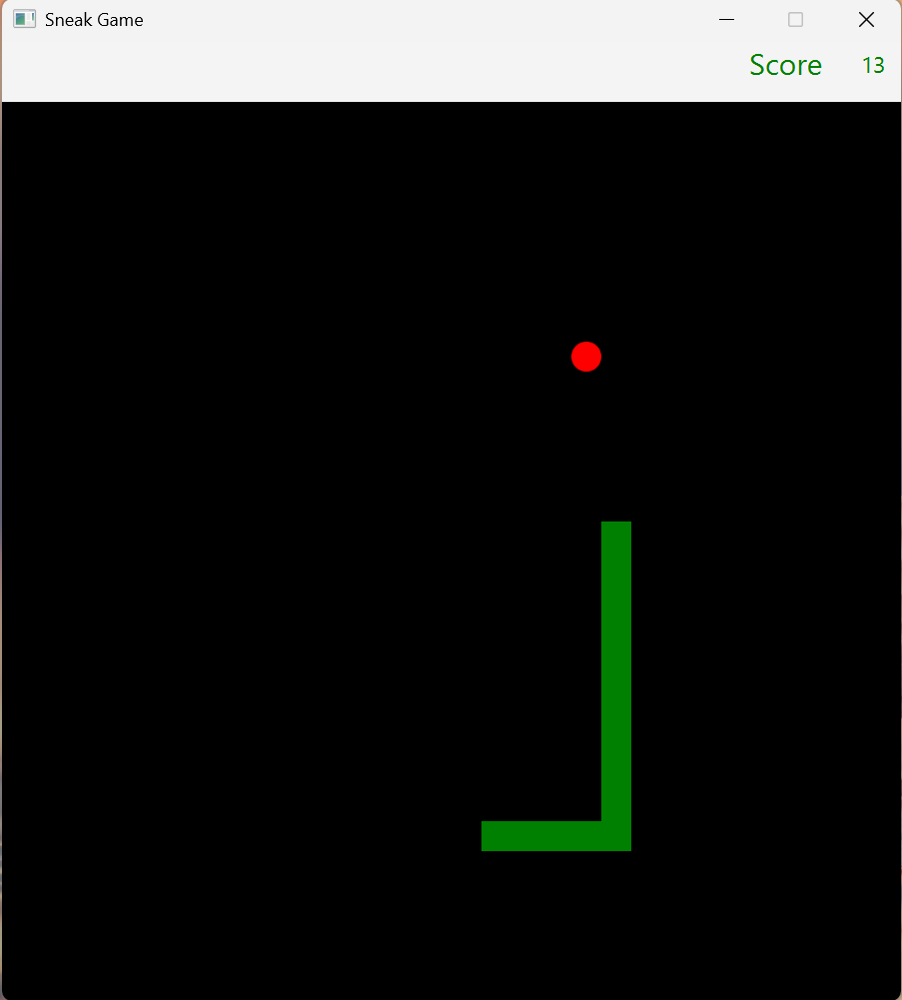
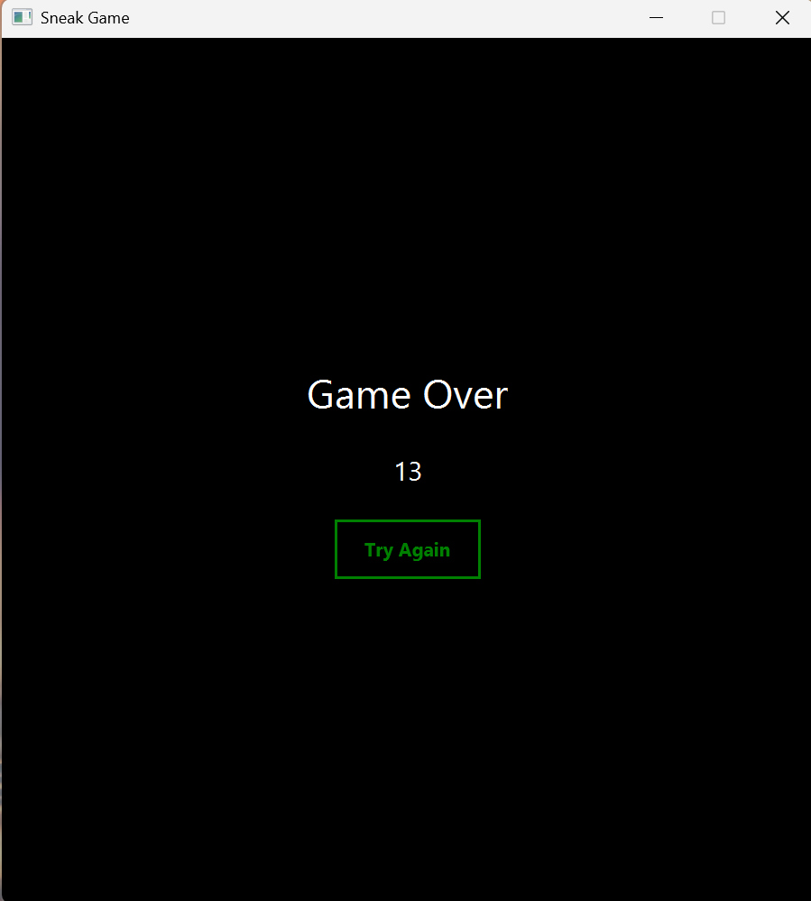

# Snake Game in JavaFX

Snake Game is a classic arcade-style game developed in **Java** using **JavaFX**. The snake moves across a grid, consumes food to grow, and the game ends if it collides with the borders or itself.

## 🚀 Features

- 🎮 **Smooth movement** using `AnimationTimer`
- ⌨️ **Keyboard controls** (Arrow keys: ↑, ↓, ←, →)
- 🍏 **Random food generation**
- 🔄 **Collision detection** with walls and itself
- ❌ **Game Over message** upon losing

## 🛠️ Technologies Used

- **Java 11+**
- **JavaFX**

## 📌 Installation & Execution

1. Clone the repository:
   ```sh
   git clone https://github.com/Ne052003/SnakekDesk.git
   cd SnakekDesk
   ```
2. Ensure **JavaFX** is configured in your environment.
3. Compile and run the game:
   ```sh
   mvn clean compile exec:java
   ```
   Or, if using an IDE like **NetBeans**, run the `Main` main class.

## 🎮 Game Controls

- **↑** Move up
- **↓** Move down
- **←** Move left
- **→** Move right

## 📷 Screenshots





## 🔮 Future Improvements

- 🏆 Add difficulty levels
- 🔊 Implement sound effects and visual animations

## 👨‍💻 Author

Developed by **Neoly Moreno**. Feel free to contribute or leave suggestions!
